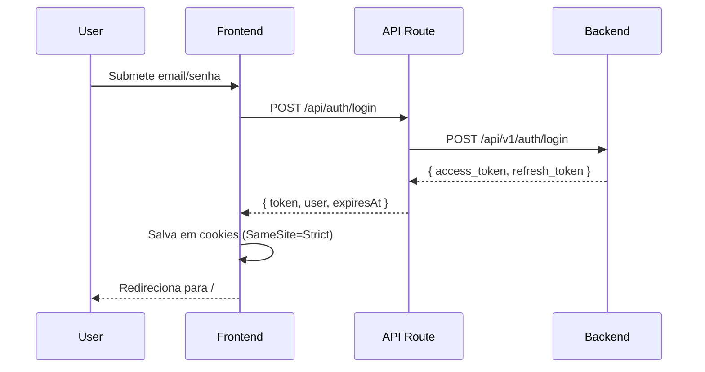

# 🔐 Autenticação

## Fluxo de Login



## Armazenamento de Tokens

**Arquivo:** `src/lib/auth/cookies.ts`

```typescript
// Cookies com proteção CSRF
const COOKIE_OPTIONS = {
  secure: process.env.NODE_ENV === 'production',
  sameSite: 'strict',
  expires: 7, // 7 dias
  path: '/'
}
```

| Cookie | Propósito | Expiração |
|--------|-----------|-----------|
| `auth_token` | JWT de acesso | 7 dias |
| `refresh_token` | Renovação | 7 dias |

## Proteção de Rotas

**Arquivo:** `src/lib/auth/middleware.tsx`

```tsx
// HOC para rotas protegidas
export function withAuth<P>(Component: ComponentType<P>) {
  // Redireciona para /login se não autenticado
}

// Componente guard
<AuthGuard requiredRole="admin">
  <AdminPanel />
</AuthGuard>
```

## Token Refresh

**Arquivo:** `src/lib/auth/token-refresh.ts`

- Renova automaticamente antes de expirar
- Fila de requests durante refresh
- Fallback para logout se falhar

## Logout

```typescript
// src/lib/auth/cookies.ts
export const clearAllTokens = () => {
  removeAuthToken()
  removeRefreshToken()
}
```

## Endpoints de Auth

| Método | Rota | Descrição |
|--------|------|-----------|
| POST | `/api/auth/login` | Login |
| POST | `/api/auth/register` | Registro |
| POST | `/api/auth/logout` | Logout |
| POST | `/api/auth/refresh` | Refresh token |
| GET | `/api/auth/me` | Dados do usuário |
