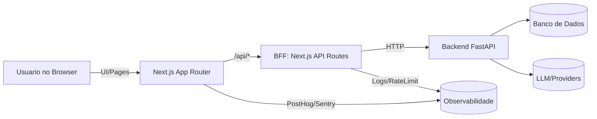
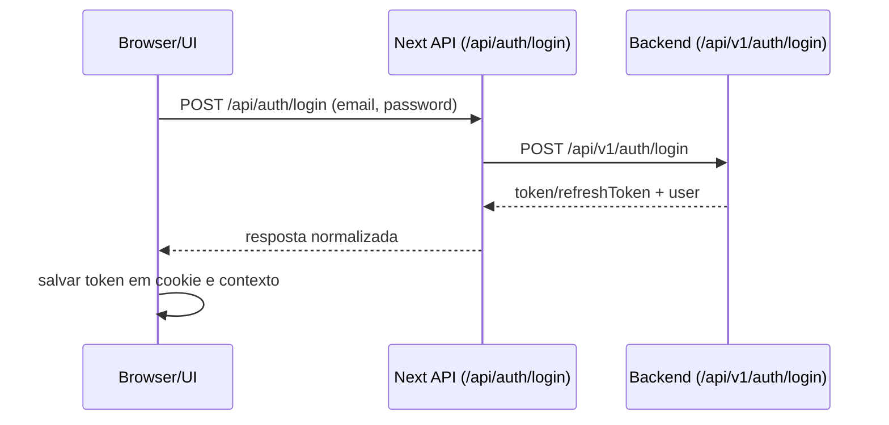
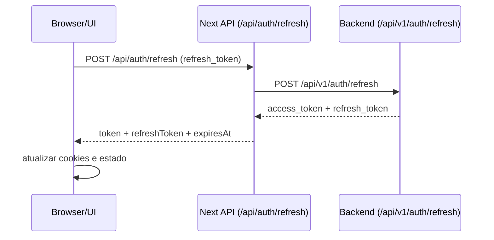
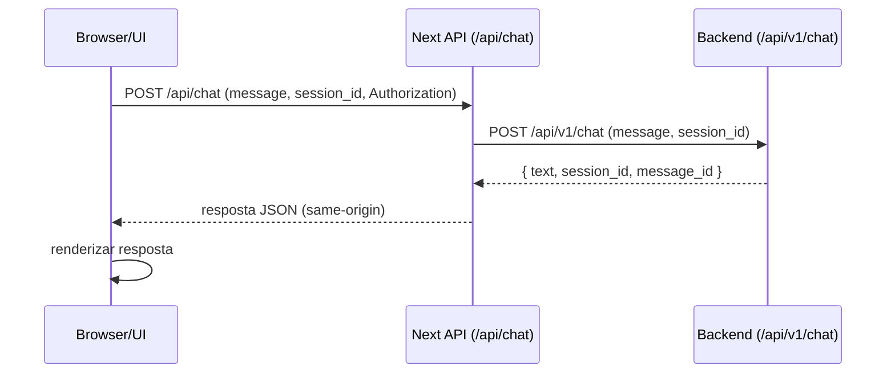
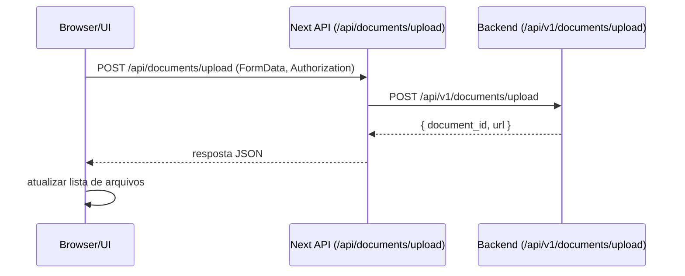

# BFF (Backend for Frontend) - Arquitetura e Fluxos

Este documento explica, em detalhes, como o BFF funciona neste projeto, quais
responsabilidades ele assume, e como os fluxos de dados percorrem o frontend,
o BFF e o backend.

## Visao Geral

O projeto usa Next.js (App Router) com rotas de API em `src/app/api/**` para
atuar como BFF. Isso significa que o frontend nao chama o backend direto.
Em vez disso, o browser fala com o BFF no mesmo dominio, e o BFF faz proxy
para o backend real, normalizando erros, padroes de resposta e headers.

Beneficios praticos:

- Same-origin (menos problemas de CORS e preflight).
- Segredos e tokens podem ficar no servidor.
- Padronizacao de payloads e erros.
- Rate limit, cache, logging e metricas centralizados.
- Evolucao do backend sem quebrar o frontend.

## Diagrama de Arquitetura (alto nivel)



## Onde o BFF vive no codigo

- Rotas BFF: `src/app/api/**/route.ts`
- Middleware de seguranca: `src/middleware.ts`
- Auth client: `src/lib/auth/api.ts`
- Contexto de auth: `src/contexts/AuthContext.tsx`
- Chat: `src/app/api/chat/route.ts` + `src/hooks/useAIStreamHandler.tsx`
- Documentos: `src/app/api/documents/**` + `src/hooks/useChatFiles.ts`

## Fluxos Principais

### 1) Login (auth)



Responsabilidade do BFF:

- Encaminhar a chamada.
- Normalizar erros e formato de resposta.
- Evitar CORS (same-origin).

### 2) Refresh Token



Ponto chave:

- O BFF deve padronizar o nome dos campos e o frontend deve esperar o mesmo
  contrato (ex: `token` vs `access_token`).

### 3) Chat (mensagem)



Responsabilidade do BFF:

- Validar `session_id`.
- Encaminhar auth header.
- Uniformizar mensagens de erro.

### 4) Upload e documentos



## Fluxo Visual Simplificado (ASCII)

```
Browser (UI)
  |
  | 1) /api/* (same-origin)
  v
BFF (Next.js API Routes)
  | 2) Normaliza + valida + aplica regras
  v
Backend (FastAPI)
  | 3) Logica de negocio / DB / LLM
  v
Resposta padronizada
  |
  v
Browser (UI)
```

## Por que este BFF existe

1. Seguranca e segredos
   - O browser nao pode guardar chaves secretas.
   - O BFF roda no servidor, entao pode falar com APIs privadas.

2. CORS simplificado
   - O browser fala com o mesmo dominio do frontend.
   - Menos preflight e menos cabecalhos CORS no backend.

3. Normalizacao de contratos
   - O backend pode ter formatos variados.
   - O BFF deixa o frontend sempre com o mesmo formato.

4. Observabilidade
   - O BFF centraliza logs, rate limiting e metricas.

## Responsabilidades do BFF (na pratica)

- Proxy de requests para o backend.
- Validacao simples (ex: `session_id`).
- Normalizacao de erros (`detail` -> mensagem padrao).
- Rate limiting e headers de seguranca.
- Cache curto quando apropriado (ex: listagem de arquivos).

## Boas praticas ao criar nova rota BFF

1. Criar rota em `src/app/api/<feature>/route.ts`.
2. Ler o body/params com validacao minima.
3. Encaminhar para o backend usando `fetch`.
4. Normalizar o formato de resposta e erros.
5. Incluir headers de cache quando fizer sentido.
6. Cobrir com testes (quando a suite existir).

Exemplo basico (estrutura):

```ts
// src/app/api/example/route.ts
import { NextRequest, NextResponse } from 'next/server'

export async function POST(request: NextRequest) {
  try {
    const body = await request.json()
    const response = await fetch(
      `${process.env.NEXT_PUBLIC_API_URL}/api/v1/example`,
      {
        method: 'POST',
        headers: { 'Content-Type': 'application/json' },
        body: JSON.stringify(body)
      }
    )

    if (!response.ok) {
      const data = await response.json().catch(() => ({}))
      return NextResponse.json(
        { detail: data.detail || 'Erro' },
        { status: response.status }
      )
    }

    const data = await response.json()
    return NextResponse.json(data, { status: 200 })
  } catch (error) {
    return NextResponse.json({ detail: 'Internal error' }, { status: 500 })
  }
}
```

## Variaveis de ambiente relevantes

- `NEXT_PUBLIC_API_URL`: base do backend.
- `NEXT_PUBLIC_APP_URL`: origem do frontend (para CORS no BFF).
- `UPSTASH_REDIS_REST_URL/TOKEN`: rate limit.
- `NEXT_PUBLIC_POSTHOG_*`: analytics.
- `NEXT_PUBLIC_SENTRY_DSN`: erros no client.
- `SENTRY_*`: source maps no build.

## Como o fluxo roda em producao

1. Usuario acessa o frontend (Vercel/host).
2. A UI chama `/api/*` no mesmo dominio.
3. O BFF executa no servidor (serverless/edge).
4. O BFF chama o backend real.
5. O BFF devolve a resposta normalizada.

Isso garante:

- Menos exposicao de segredos.
- Menos problemas de CORS.
- Evolucao do backend sem quebrar o frontend.

## Observacoes finais

- Este BFF nao substitui o backend: ele adapta e protege o acesso.
- Se um dia houver um API Gateway/Edge robusto, o BFF pode ser reduzido para
  rotas criticas (auth/upload).
- Em projetos B2B com auth e dados sensiveis, manter BFF costuma ser a escolha
  mais segura e estavel.
