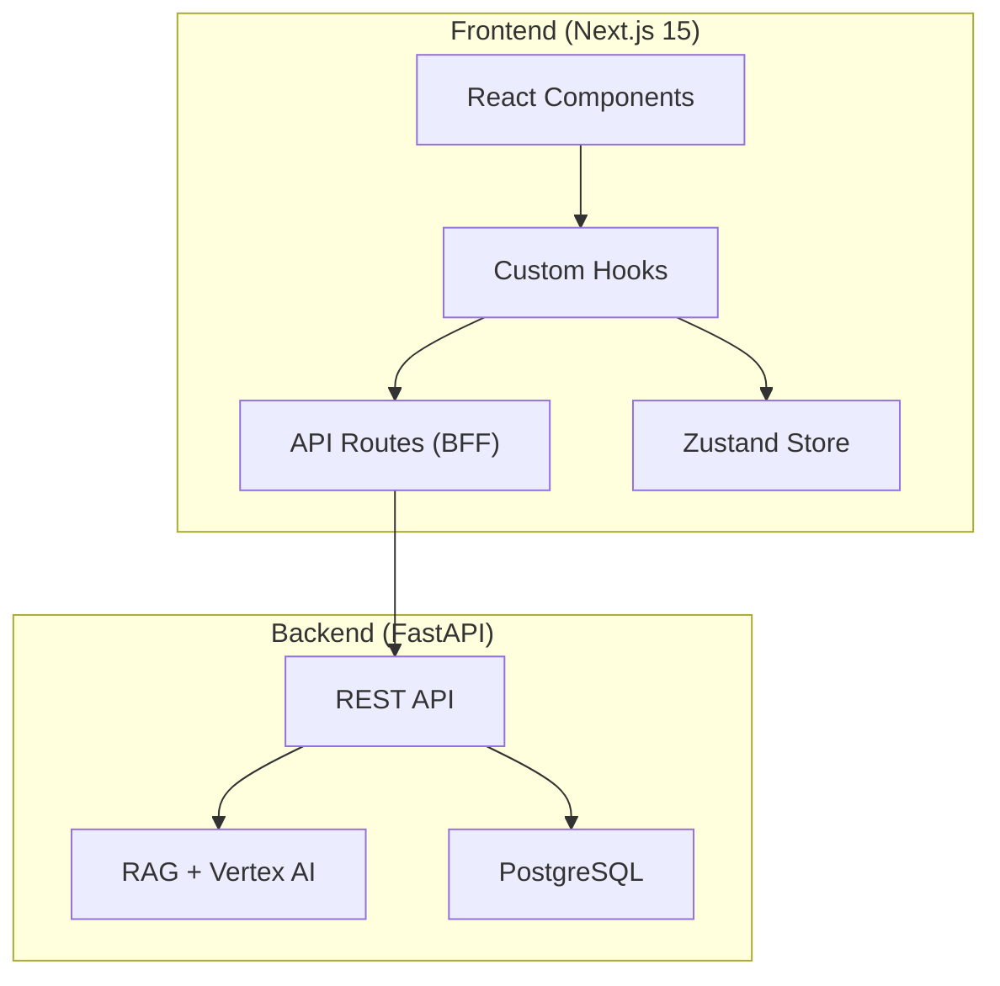

# 🏗️ Arquitetura do Sistema

## Visão Geral



## Camadas

### 1. UI Layer (`/components`)
- **`ui/`** - Componentes primitivos (Button, Input, Dialog)
- **`v2/`** - Componentes de features (ChatArea, FileUpload)

### 2. Logic Layer (`/hooks`)
Hooks gerenciam estado e side effects:
- `useAuthHook` - Estado de autenticação
- `useChatFiles` - Upload e gestão de arquivos
- `useSessions` - Gerenciamento de sessões de chat

### 3. BFF Layer (`/app/api`)
API Routes como proxy seguro para o backend:
- Adiciona headers de auth
- Rate limiting (Upstash)
- CSRF protection

### 4. State Layer (`/stores`)
Zustand para estado global:
- `chatStore` - Mensagens e sessão ativa
- `uiStore` - Estado de UI (sidebars, modals)

## Fluxo de Dados

```
User Action → Component → Hook → API Route → Backend → Response
     ↓                      ↓
  UI Update ← Store Update ←
```

## Decisões de Arquitetura

| Decisão | Motivo |
|---------|--------|
| App Router | Server Components, Streaming |
| BFF Pattern | Segurança, CORS, Rate Limiting |
| Zustand vs Redux | Simplicidade, menor boilerplate |
| Cookies vs localStorage | Segurança (SameSite) |
